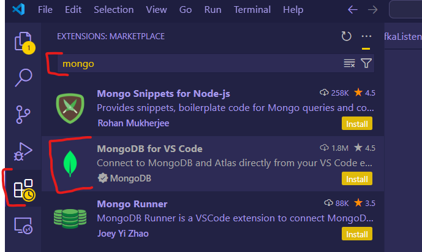
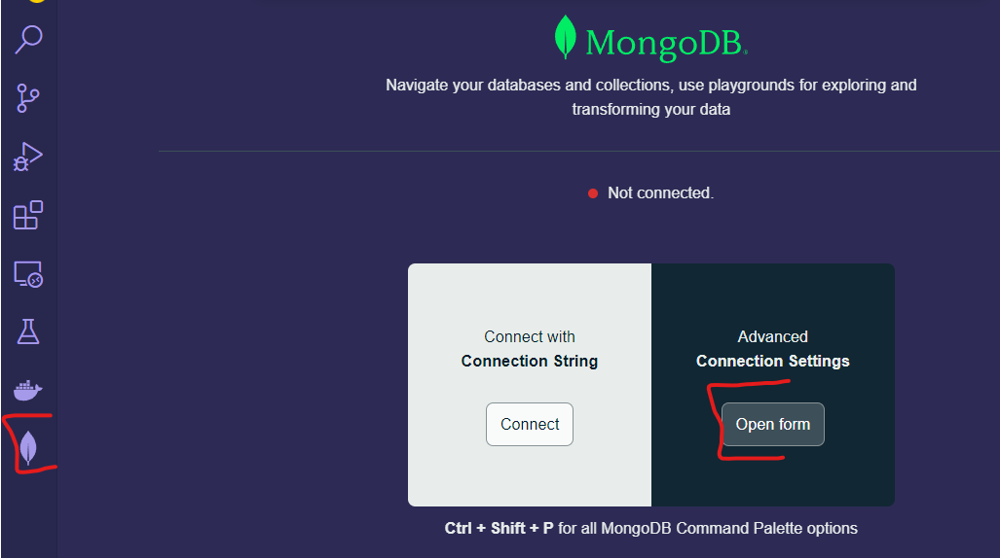
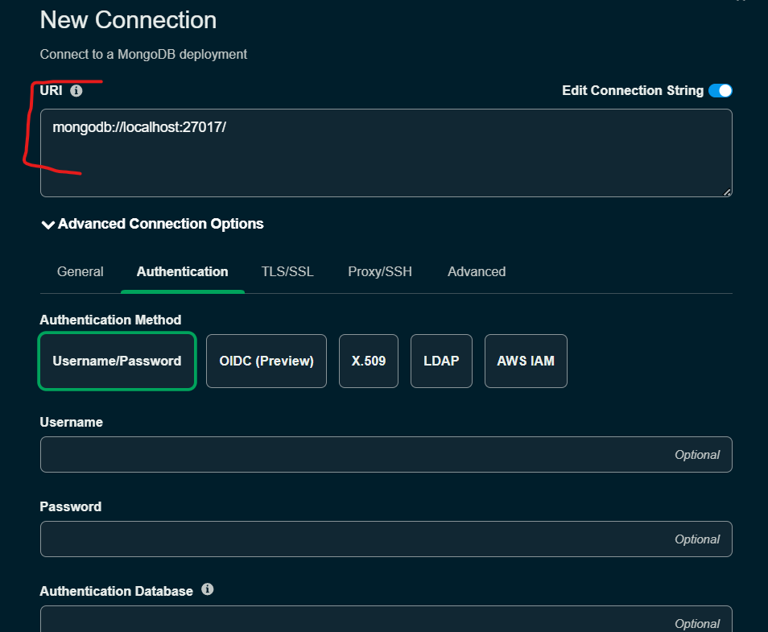
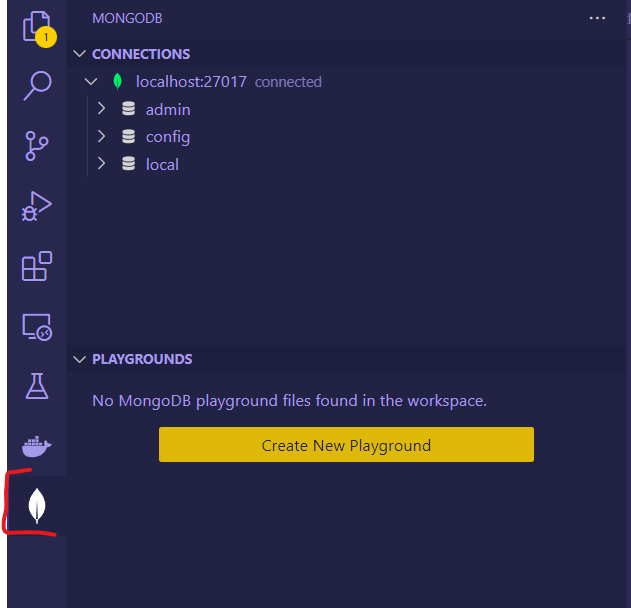

## MongoDB en Docker-Comper
(Esta conexión es meramente edicativa, para temas productivos se debe de usar otra imagen y configurar un usuario y contraseña)

### Run Mongo containe
```docker compose -f <fileName.yml> up -d```


## Conectar a Mongo

Para visualizar los esquemas de BD, instalamos la siguiente extención en Visual studio code


Nos conectamos


Dejamos la configuración como está <br>
(Esta conexión solo es Educativa en un entorno Real sebe de usar un usuario y contraseña)


Ahora podemos ver la conexión:

